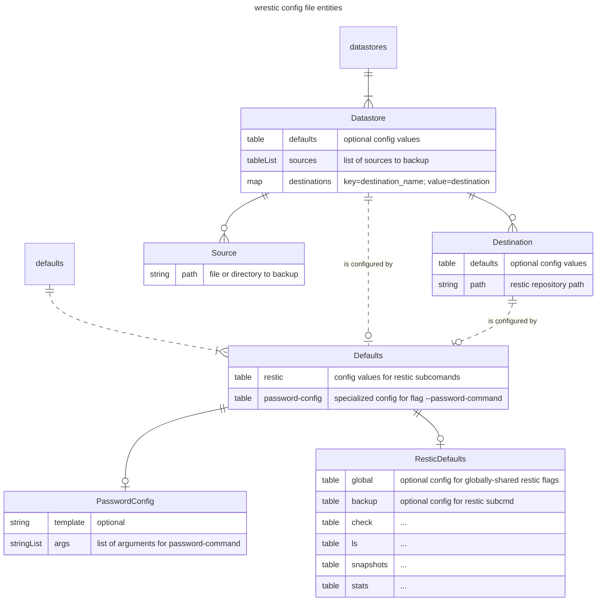

# wrestic

[](https://github.com/rafaelespinoza/wrestic/actions)
[](https://codecov.io/gh/rafaelespinoza/wrestic)

This is a thin wrapper around [restic](https://github.com/restic/restic).

It's a CLI tool and configuration file, meant to help you:
- keep track of what to backup (sources) and paths to backup repositories (destinations) so they're easier
  to associate to one another.
- generate command line arguments and flags to pass to restic.

Some design intentions around `wrestic`:
- Let the configuration drive, but make it easy to override at runtime.
- Dry runs by default, print the generated restic flags to stderr.
- Don't do things a whole lot differently than what the real restic does.

This tool is certainly influenced by other restic configuration tools, such as:
- [autorestic](https://autorestic.vercel.app)
- [restic profile](https://creativeprojects.github.io/resticprofile)

but it differs in some ways:
- Specialized support for building the restic flag, `password-command`.
- The only supported configuration file format is TOML. JSON is horrible for configuration (where the
  comments at?), INI does not seem to have consistent support for collection types, YAML gets too
  complicated. TOML, while not perfect, provides a good mix of simplicity, support for collection data
  structures, and comments. Support of only 1 configuration file format is driven by:
  - distaste for configuration files
  - simplification of configuration merge logic

## Usage

Run `wrestic config init` to set up a directory structure on the host so this tool can look up any
configuration or data as needed. By default, the config directory path depends on the host system.
Run `wrestic config` to see that default directory. Subcommands that require a configuration file may
override the configuration directory with the `-C` flag.

Invoke a restic subcommand with `wrestic exec <subcommand>`, where `<subcommand>` is the name of a restic
subcommand. CLI flag values are generated by reading the configuration file. Default configuration may be
specified at multiple levels, and is merged together at runtime (more on this below). The merged, generated
flags are output to STDERR as a shell comment. This is intended to make it easy to use restic directly.

Running `wrestic exec <subcommand>` may also operate on multiple restic repositories in sequence.
Filter which restic repositories are operated upon with the `-storenames`, `-destnames` flags.

Another way to see merged configuration values is with `wrestic config show`. This subcommand also takes the
`-storenames`, `-destnames` flags to filter which restic repositories are read and merged.

## Configuration

A [TOML](https://toml.io)-formatted file, `wrestic.toml`, defines default configuration values, source
paths to backup and locations of backup repositories.
See an [example wrestic.toml](internal/config/testdata/wrestic.toml).

### Config file entities

_TLDR_

There may be these top-level keys: `defaults`, `datastores`. Each has their own structure. The `defaults`
key may also appear under a datastore and/or a destination in order to guide configuration merges.



- `defaults`: Any default configuration values for restic.
  - `password-config`: A specialized configuration type to manage the password-command flag for restic subcommands.
  - `restic`: Contains general configuration values for restic subcommands.
- `datastores`: Maps the names of datastores to datastores. So, the key of the map is a datastore name, and the value is the datastore.
  - `<name_of_datastore>`
    - `defaults`: These are default configuration values that only apply to destinations underneath the datastore. Specified values override those of the top-level defaults and unspecified values are merged in from the top-level defaults.
    - `sources`: List of things to backup to a restic repository.
    - `destinations`: Map names of destinations to destinations. A destination is a restic repository.
      - `<name_of_destination>`
        - `defaults`: These are default configuration values that only apply to a destination under a specific datastore. Specified values override those of the datastore's defaults and unspecified values are merged in from the datastore defaults.

#### Defaults

These are configuration values, and may appear:
1. at the top-level of the configuration file (`[defaults]`)
1. at the datastore level (`[datastores.<storename>.defaults]`)
1. at the destination level (`[datastores.<storename>.destinations.<destname>.defaults]`)

When invoking a restic subcommand through `wrestic exec`, configuration values from the top level are merged
into the datastore defaults. Then datastore defaults are merged into the destination defaults. The merged
configuration values on the destination are converted into restic command line flags.

#### Restic

Key values underneath a `[defaults.restic]` key in the config file are designed to correspond directly to a
flag that the real restic uses. Flags that are made available for any restic subcommand may be defined under
the `global` key, because they appear as "Global Flags" in restic's usage menu.

When the restic flag may be specified multiple times, then it is an array in the config file.
One exception to this is the restic flag, `--verbose`. To specify verbosity, use a number.

##### Restic examples

```toml
[defaults.restic.global]
verbose = 2

[defaults.restic.backup]
dry-run = true
iexclude = ['*.DS_Store*', '._*', '*.sw']

[defaults.restic.ls]
long = true
tag = ['foo', 'bar']

[defaults.restic.snapshots]
group-by = ['host', 'paths']
latest = 3
```

#### PasswordConfig

Construct the `password-command` flag in restic. In the config file, it appears under
`[defaults.password-config]`.

Use `template`, and `args` fields to prepare a password command. Interpretation of the `template` field is
implemented by package [`text/template`](https://pkg.go.dev/text/template) from the golang standard library.
Placeholders may be marked with `{{` and `}}`. Values from the `args` field may be referenced by
placeholders in the template string.

##### PasswordConfig template functions

`filename`: takes a filepath (type string), returns a filepath (type string). If the input is a relative
filepath, then the output will be prefixed with a configuration directory, and then cleaned up (like,
removing unnecessary `..`). If the input is an absolute filepath, then the output is just cleaned up input.

`filenameArg`: takes an index (type int), returns a filepath (type string). The input index should be the
index of the `args` field. Other than that, it behaves in the same way as the `filename` template function.
This template function may be helpful if your restic repositories have different passwords from each other.

##### PasswordConfig examples

Let's say you have already encrypted your restic password in a file, but the decryption tool does not impose
a particular directory structure. You could store the encrypted files in the wrestic config dir (created via
subcommand `wrestic config init`), and reference those files under the `password-config` key. These examples
use [age](https://github.com/FiloSottile/age).

###### Example with `filename`

```toml
[defaults.password-config]
template = 'age -d -i {{ filename "age_id" }} {{ filename "password.age" }}'
```
If the config directory is `/path/to/config`, then the generated output would be
```
--password-comand='age -d -i /path/to/config/age_id /path/to/config/password.age'
```

###### Example with `filenameArg`

This example references two separate file paths in `args`, which are written as relative to a config
directory.
```toml
[defaults.password-config]
template = 'age -d -i {{ filenameArg 0 }} {{ filenameArg 1 }}'
args = ['age_id', 'password.age']
```
If the config directory is `/path/to/config`, then the generated output would be
```
--password-comand='age -d -i /path/to/config/age_id /path/to/config/password.age'
```

###### Example with both, env vars

Environment variables should work with filename placeholders
```toml
[defaults.password-config]
template = 'age -d -i {{ filename "$XDG_CONFIG_HOME/secrets/id" }} {{ filenameArg 0 }}'
args = ['$XDG_CONFIG_HOME/secrets/restic.age']
```
If `XDG_CONFIG_HOME=/home/username/.config`, then the generated output would be
```
--password-comand='age -d -i /home/username/.config/secrets/id /home/username/.config/secrets/restic.age'
```

#### Datastore

A canonical, yet arbitrary name for a set of data that may be backed up to multiple destinations.

A datastore will appear under the `[datastores.<storename>]` key in the config file. The `<storename>` is a
human-readable identifier that may be referenced in filtering with the `-storenames` flag.

A datastore contains 0 or more sources.
A datastore contains 0 or more destinations.

Datastores may specify their own set of defaults. Any unspecified values will be merged in from the
top-level defaults.

#### Source

A file system path on a host, meant to be backed up. In the config file, these appear under
`[datastores.<storename>.sources]`.

A source is contained by a datastore.

#### Destination

A restic repository. In the config file, these appear under
`[datastores.<storename>.destinations.<destname>]`, where the `<destname>` is a human readable identifier
to reference in filtering with the `-destnames` flag.

A destination is contained by a datastore.

Like datastores, destinations may specify their own set of defaults. Any unspecified values are merged in
from datastore defaults, and by proxy the top-level defaults.
